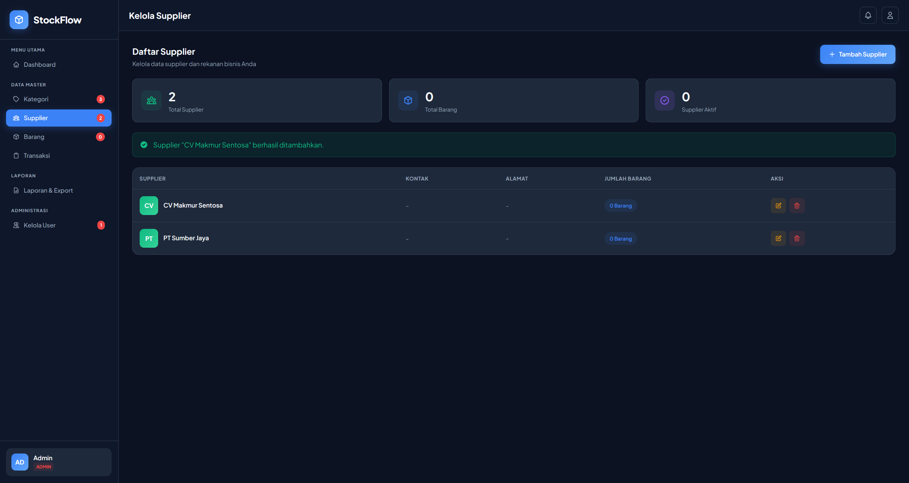

# StockFlow Inventory — Web-Based Inventory Management System

StockFlow adalah aplikasi **Inventory Management System** berbasis web untuk membantu pengelolaan **barang, kategori, supplier, stok, serta laporan analisis inventaris**.  
Project ini menonjolkan **dashboard analytics**, **validasi data**, dan **export laporan** dengan UI modern.

> ✅ Cocok untuk showcase **Fullstack / Backend (Laravel)** karena mencakup CRUD, relasi database, reporting, dan export.

---

## Highlights

- 📊 **Dashboard Analytics**: Total aset inventaris, potensi profit (margin), indikator stok, dan visualisasi komposisi kategori  
- 📦 **Inventory CRUD**: Barang terhubung ke kategori & supplier, stok minimum, harga beli/jual, status stok otomatis  
- 🤝 **Supplier & Category Management**: Ringkasan jumlah barang per supplier/kategori  
- 📑 **Report & Export**: Laporan analisis stok + **export PDF**  
- 🔐 **Authentication**: Login untuk akses halaman internal (admin)

---

## Tech Stack

- **Backend**: Laravel 12, PHP 8+
- **Database**: MySQL
- **Frontend**: Blade, Tailwind CSS
- **Charts / Visualization**: Chart.js
- **Build Tooling**: Vite, NPM
- **Architecture**: MVC (Controller, Model, View), Validation, Migration/Seeder

---

## Features

### Dashboard
- KPI: total aset inventaris & potensi profit
- Ringkasan: total produk, supplier, kategori
- Indikator: stok aman / menipis / habis
- Grafik: komposisi stok per kategori
- List: stok terbanyak & stok terendah

### Master Data
- **Kategori**: create/update/delete, jumlah barang per kategori
- **Supplier**: create/update/delete, jumlah barang per supplier
- **Barang**:
  - SKU/Code otomatis (format seperti `BRG-00001`)
  - stok minimum & status stok otomatis
  - harga beli & harga jual

### Reporting
- Laporan analisis stok:
  - KPI aset & profit
  - distribusi kesehatan stok
  - top stok menipis/habis & top stok terbanyak
  - detail inventaris lengkap
- **Export laporan PDF**

> Catatan: fitur transaksi sedang disesuaikan pada beberapa environment (perbedaan struktur kolom). Focus portfolio project: **inventory + reporting + export**.

---

## Screenshots

> Lokasi: folder `screenshots/`

### Dashboard


### Inventory (Barang)


### Categories (Kategori)


### Suppliers (Supplier)


### Report & Export (PDF)


---

## Getting Started (Local Setup)

### 1) Clone
```bash
git clone https://github.com/RickyRudiansyah/StockFlow-Inventory.git
cd StockFlow-Inventory

2) Install Dependencies

composer install
npm install

3) Setup Environment

cp .env.example .env
php artisan key:generate

Edit .env (MySQL):

DB_CONNECTION=mysql
DB_HOST=127.0.0.1
DB_PORT=3306
DB_DATABASE=stockflow
DB_USERNAME=root
DB_PASSWORD=

4) Database Migration & Seed

php artisan migrate --seed

5) Build Assets

Untuk build sekali:

npm run build

Atau mode development (lebih enak saat ngoding):

npm run dev

6) Run Server

php artisan serve

Buka:

http://127.0.0.1:8000

Demo Account

Gunakan akun hasil seeder (jika tersedia).
Jika tidak ada, buat admin manual via tinker:

php artisan tinker

\App\Models\User::create([
  'name' => 'Admin',
  'email' => 'admin@stockflow.test',
  'password' => bcrypt('admin123'),
]);

Login:

    Email: admin@stockflow.test

    Password: admin123

Project Scope

Project ini berfokus pada:

    Perancangan database inventory (relasi barang-kategori-supplier)

    Validasi input & data integrity

    Reporting & export PDF

    UI dashboard untuk monitoring inventory

Contributors

    Ricky Rudiansyah

    Privanza Wisnu

    saleh1717

